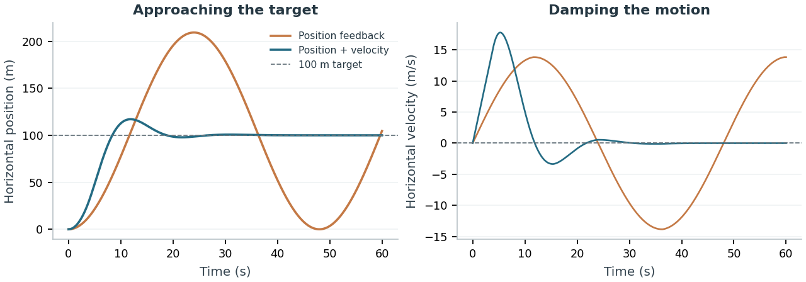
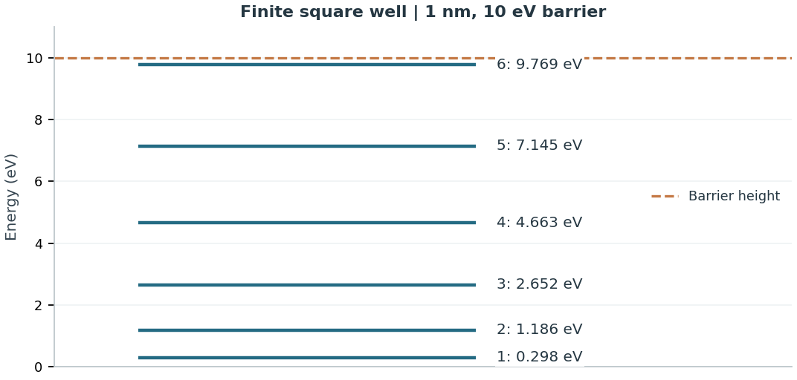
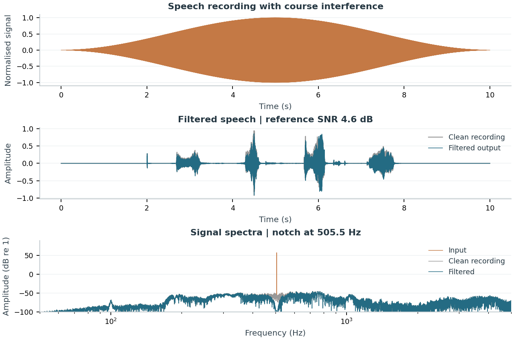
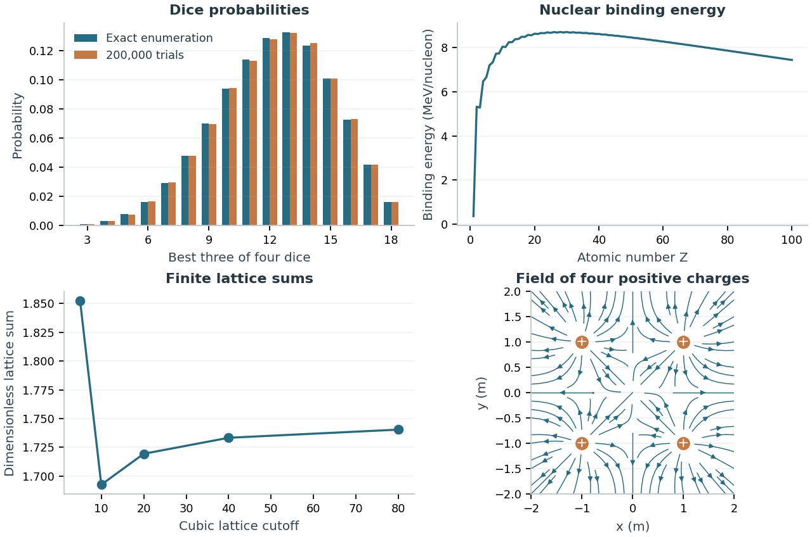

# Scientific Python Projects

Assessed computational-physics work from my degree at the University of Birmingham, covering **quantum mechanics, Fourier analysis, signal processing and feedback control**.

## Self-landing rockets

**90%, highest in the cohort** · [Source code](projects/Project_3_Self_Landing_Rockets.py)

I investigated a two-dimensional rocket simulator, using numerical experiments to identify its dynamics before constructing positioning and landing controllers. The work covered thruster offsets, mass and thrust estimates, acceleration-to-thrust mapping, proportional feedback and damped PD-style control using position and velocity.

The analysis separates the initial identification experiments from the control strategies and repeated drop tests. The controller combines position error with velocity feedback to reduce overshoot.

*Horizontal positioning in the supplied rocket simulator: adding velocity feedback damps the oscillations around a 100 m target. A fresh run of the coursework controllers.*

## Quantum systems

**95%** · [Source code](projects/Project_1_Quantum_Systems.py)

I modelled the bound states of an electron in a finite square well, reformulating the Schrödinger equation into dimensionless even- and odd-parity equations. Bracketed numerical root finding gives the allowed energy eigenvalues.

*Six bound states calculated for a 1 nm well with a 10 eV barrier.*

The calculation locates roots between successive half-periods without crossing tangent poles, then converts the dimensionless solutions into energies. The potential and energy levels make the connection between the numerical roots and the physical states visible.

## Spectral analysis

**80%** · [Source code](projects/Project_2_Spectral_Analysis.py)

I used swept-sine signals and Fourier analysis to identify unknown electronic filters, locate unwanted spectral components and reconstruct filtered signals through a custom transfer function.

*Re-analysis of the spoken-digit recordings supplied with the university assignment, using the course noise model and the RLC band-stop filtering method.*

The course files supply real speech recordings and a generator for the interfering signal. The analysis locates the dominant interference near **505.5 Hz** from the corrupted input and applies three passes of the RLC band-stop transfer function. The figure shows the waveform and spectrum, with the clean recording available as a reference.

The noise model is a deliberately severe coursework test. The reported reference SNR includes both remaining noise and distortion of the clean signal. It describes this re-analysis, rather than an archived score from the assessed submission.

The source recordings were sampled at 44.1 kHz. The included analysis data use 11.025 kHz after anti-alias filtering and downsampling. Input arrays, source information and numerical outputs are in `data/`.

## Programming worksheets

**98% average, highest in the cohort** · [Source code](projects/Scientific_Worksheets.py)

Six worksheets cover complex arithmetic, sequences and series, conditional probability, nuclear binding energies, bisection, lattice sums, stellar data, electrostatic fields and Monte Carlo simulation.

*Figures calculated from the worksheet methods: exact and Monte Carlo dice probabilities, binding-energy searches, finite lattice sums and point-charge field directions.*

The dice calculation compares **200,000 trials** with all **1,296 possible four-die outcomes**. The nuclear calculation searches integer mass numbers for each atomic number. The Madelung calculation sums the lattice in finite cubes, while the electrostatic calculation uses the vector form of Coulomb's law.

The consolidated source separates calculations from plots and gives reusable methods named functions. Dice sampling and random walks use vectorised arrays. Input validation, units and singular points are handled in the relevant numerical routines.

The supplied archives contain the Y2 assignment templates and backend materials. The original dice-observation and stellar-catalogue files for the worksheets were not among them, so those file-based routines remain available without invented observations.

## Files and methods

| Folder | Contents |
| --- | --- |
| `projects/` | The four coursework source files and the figure-production script |
| `data/` | Course audio arrays, source information and calculated figure results |

All project figures are separate top-level PNGs. `projects/make_figures.py` records how each is produced. The raw course backend is university-supplied; the dependency is noted in `requirements.txt`.

**Tools:** Python, NumPy, SciPy and Matplotlib.

The marks refer to the assessed coursework. The figures show the calculations and re-analysis described above, with later improvements to code clarity and numerical implementation.
