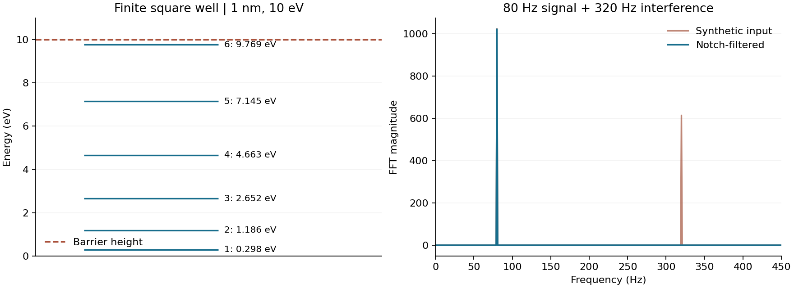

# Scientific Python Projects

Computational physics coursework from my degree at the University of Birmingham: quantum bound states, Fourier analysis, signal filtering and rocket control.

| Project | Mark | Main work |
| --- | ---: | --- |
| [Quantum systems](Project_1_Quantum_Systems.py) | **95%** | Finite square well, dimensionless equations and numerical root finding |
| [Self-landing rockets](Project_3_Self_Landing_Rockets.py) | **90%** | Identifying simulator dynamics, positioning and P/PD feedback |
| [Spectral analysis](Project_2_Spectral_Analysis.py) | **80%** | Swept-sine signals, FFTs, transfer functions and filtering |
| [Programming worksheets](Scientific_Worksheets.py) | **98% average** | Python and numerical problem solving |

## Try the public examples



The example uses a **1 nm, 10 eV finite well**, which has six bound states, and an **80 Hz signal with 320 Hz interference**. These are selected demonstration inputs. The signal is synthetic and its clean component is known, so the change in SNR can be calculated directly.

Use Python 3.12:

```bash
git clone https://github.com/Robert-Study/Scientific-Python-Projects.git
cd Scientific-Python-Projects
python -m venv .venv
```

Activate with `source .venv/bin/activate` on macOS/Linux, or `.venv\Scripts\Activate.ps1` in Windows PowerShell. Then:

```bash
python -m pip install -r requirements.txt
python demo.py
python -m unittest discover -s tests -v
```

The plot, signal CSV and numerical results are saved to `outputs/demo/`. A [saved result](assets/results.json) is included for comparison. The quantum script can also be run directly:

```bash
python Project_1_Quantum_Systems.py
```

## What can be reproduced

| Component | Available here |
| --- | --- |
| Finite-well solver | All bound-state roots for the selected parameters, bracketed between successive half-periods |
| Signal-processing helpers | Linear frequency sweeps, one-sided spectra and frequency-domain filtering |
| Standalone demonstration | Quantum energies and filtering of a known synthetic signal |
| Original audio/filter-box exercise | Requires the university's `module_engine` package and its supplied data |
| Original rocket exercise | Requires the university's `module_engine` simulator |
| Worksheets | Some file-based exercises require the original `data.txt` |

The university package is not distributed here. Its absence does not prevent importing the numerical helpers or running `demo.py`. The rocket results are not presented as a public, independently reproducible landing benchmark.

## Numerical checks

The test suite compares the well energies with a separate finite-difference Hamiltonian calculation. It also checks the swept-sine phase against SciPy's `chirp`, verifies removal of a tone at the filter's notch frequency, and checks the Nyquist bin and sampling assumptions.

The sweep phase is the integral of the instantaneous frequency. Using `sin(2π f(t)t)` for a changing frequency would give the wrong ramp. The well solver likewise avoids tangent poles when bracketing roots.

[View the tests](tests/test_numerics.py) · [GitHub Actions](https://github.com/Robert-Study/Scientific-Python-Projects/actions)

The marks refer to the original assessed submissions. The standalone examples, root bracketing and signal-generation corrections were added during later portfolio development.
